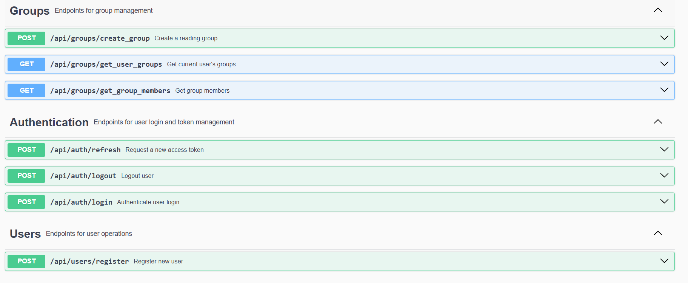

# Reading Groups API

A Spring Boot REST API for collaborative reading and annotation. Users can create accounts, create and join reading groups, and discuss specific passages by attaching comments and questions directly to shared texts.

The project focuses on building a secure backend using Spring Security with JWT authentication, refresh tokens, BCrypt password hashing, stateless session management, PostgreSQL, and file handling for reading materials.

> **Status:** Work in progress. Authentication, reading group creation, and reading text upload are implemented. Group membership and annotations are ongoing.

**Tech Stack:** Spring Boot 3 · Spring Security · JWT · JPA/Hibernate · PostgreSQL · Maven · Swagger/OpenAPI · JUnit 5 · Mockito

---

## Features

### Implemented

- User registration and authentication
- JWT authentication (access and refresh tokens)
- Token refresh endpoint
- Logout with refresh token revocation
- BCrypt password hashing
- Stateless Spring Security configuration
- Custom JWT authentication filter
- Reading group creation
- PDF reading text upload and storage
- Uploaded PDF validation
- Retrieval of groups associated with a user
- Retrieval of reading group members
- User/group many-to-many persistence
- Global exception handling
- Request validation using Bean Validation
- Swagger/OpenAPI documentation
- Unit tests with JUnit 5 and Mockito

### In Progress

- Joining and leaving reading groups
- Passage-level comments and questions
- Group permissions and moderation
- Further reading group management

---

## Screenshots

### Swagger API Documentation



---

## Database

The project uses PostgreSQL with the following schema:

- Users
- Groups
- Categories
- Comments
- Users_Groups (many-to-many relationship)

The full database schema is available at:

```
src/main/resources/schema.sql
```

---

## API Documentation

Swagger UI is available at:

```
http://localhost:8080/swagger-ui/index.html
```

---

## Environment Variables

The following environment variables are required:

- `DB_URL`, `DB_USERNAME`, `DB_PASSWORD` (PostgreSQL database connection)
- `JWT_SECRET` (JWT signing key)