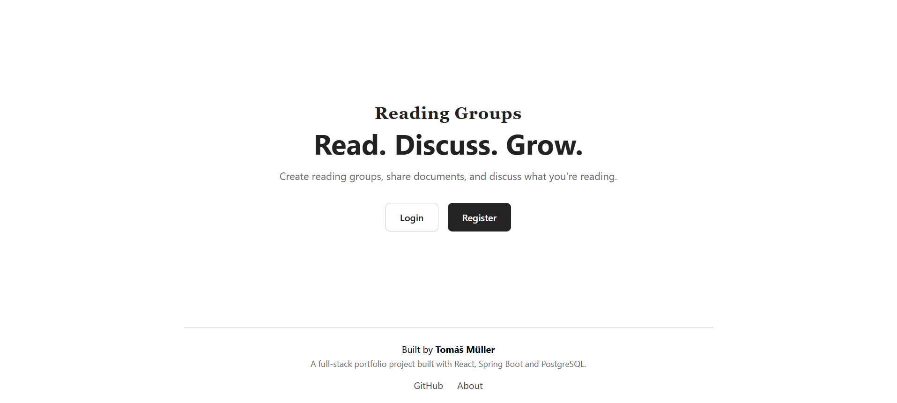
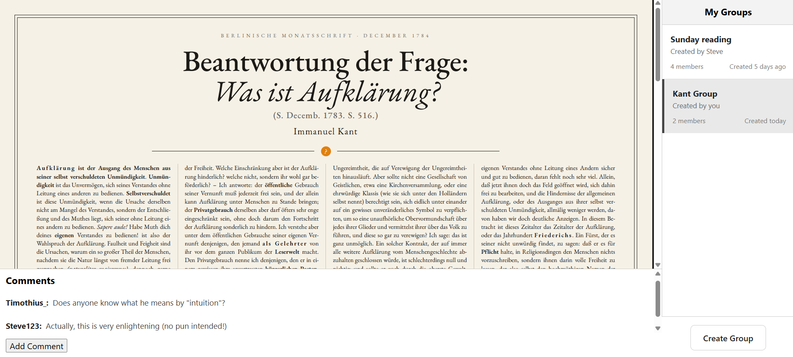
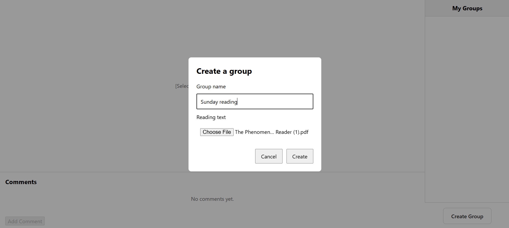
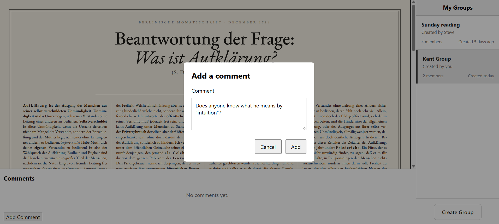
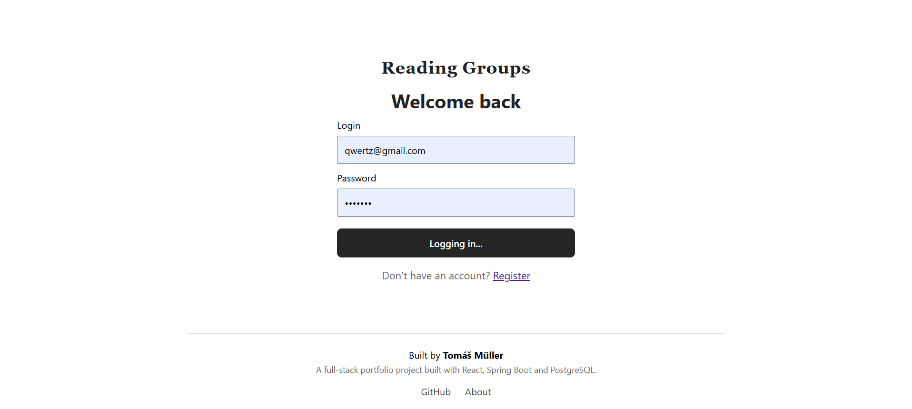
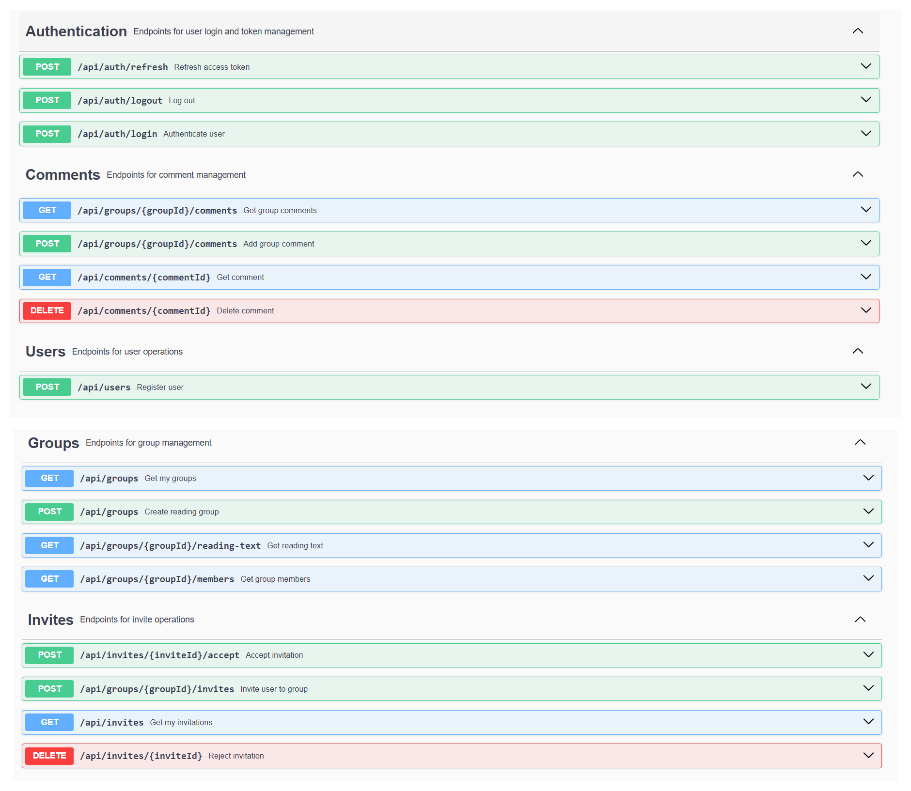

# Reading Groups

A web application for creating reading groups, sharing PDF documents, and discussing texts with other members.

Built with React, TypeScript, Spring Boot, and PostgreSQL. Containerized with Docker and deployed using GitHub Actions.

**[Live application](https://reading-groups.site)**



## Features

- User registration and JWT-based authentication
- Reading group creation with PDF uploads
- Group membership and invitations
- In-browser PDF viewing
- Comments associated with passages in a document
- Group-based access control

## Tech Stack

| Component | Technologies |
|---|---|
| Frontend | React, TypeScript, Vite |
| Backend | Java 17, Spring Boot, Spring Security, Spring Data JPA |
| Database | PostgreSQL |
| API | REST, JWT, Springdoc OpenAPI |
| Infrastructure | Docker Compose, Caddy, GitHub Actions, GHCR |
| Testing | JUnit 5, Mockito |

## Screenshots

### Reading and Discussion



### Creating a Group



### Adding a Comment



### Login



## Architecture

The React frontend communicates with a Spring Boot REST API, which handles authentication, authorization, PDF storage, and database operations.

PostgreSQL stores application data, while uploaded PDFs are stored separately in a persistent volume.

In production, Caddy serves the frontend, proxies API requests to Spring Boot, and handles HTTPS.

## Running Locally

### Requirements

- Docker
- Docker Compose

Clone the repository and navigate to its root directory.

Create a `.env` file with the required configuration:

```env
DB_NAME=reading_database
DB_USER=database_user
DB_PASSWORD=your_database_password
JWT_SECRET=your_jwt_secret
```

Use a securely generated JWT secret.

Build and start the application:

```bash
docker compose up -d --build
```

The application will be available at **http://localhost**.

To view the logs:

```bash
docker compose logs -f
```

To stop the containers:

```bash
docker compose down
```

Database data and uploaded files are preserved in Docker volumes.

### Running the Frontend Separately

The frontend can also be started with Vite:

```bash
cd frontend
npm ci
npm run dev
```

This requires a running backend and appropriate API proxy configuration.

## API Documentation

The REST API is documented using Springdoc OpenAPI and Swagger UI. Endpoints cover authentication, users, groups, comments, and invitations.



When running the application locally with Docker Compose:

- [Swagger UI](http://localhost/swagger-ui/index.html)
- [OpenAPI specification](http://localhost/v3/api-docs)

## Testing

Run the backend tests from the `backend` directory:

```bash
./mvnw test
```

Run the frontend linter:

```bash
cd frontend
npm run lint
```

## Deployment

The application is deployed to a VPS using Docker Compose.

GitHub Actions runs the backend tests, builds the frontend and backend Docker images, publishes them to GitHub Container Registry, and deploys updated images to the VPS.

The production configuration is defined in `compose.prod.yaml`. Caddy handles HTTPS and reverse proxying, while PostgreSQL and uploaded files use persistent Docker volumes.

**[reading-groups.site](https://reading-groups.site)**
