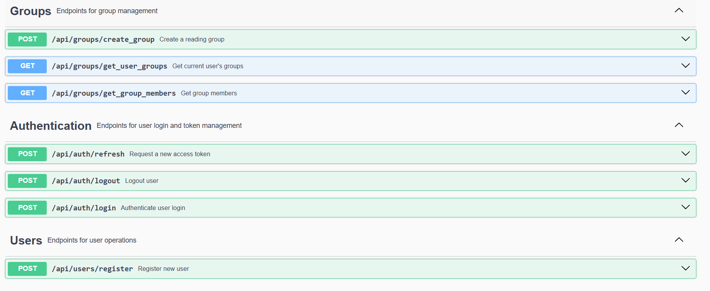

# Reading Groups API

A Spring Boot REST API for collaborative reading and annotation. Users can create accounts, create reading groups around shared PDF texts, invite other users, and discuss specific passages through comments linked to the reading material.

The project focuses on building a secure and maintainable backend using Spring Security, JWT authentication with access and refresh tokens, PostgreSQL, file handling and validation, RESTful API design, automated testing, containerization, and CI/CD.

> **Status:** Core backend functionality is implemented, including authentication, reading groups, PDF storage and retrieval, invitations, group membership, and passage-level comments. Further group management and moderation features are planned.

**Tech Stack:** Java 17 · Spring Boot · Spring Security · JPA/Hibernate · PostgreSQL · JWT · Maven · Docker · Caddy · Swagger/OpenAPI · JUnit 5 · Mockito · GitHub Actions

---

## Features

### Implemented

* User registration and authentication
* JWT authentication with separate access and refresh tokens
* Access token renewal using refresh tokens
* Logout with refresh token revocation
* BCrypt password hashing
* Stateless Spring Security configuration
* Request validation using Bean Validation
* Reading group creation and retrieval
* Reading group member retrieval
* Invitation-based group membership
* Invite creation, acceptance, and rejection
* PDF reading material upload, retrieval, and storage
* PDF content validation using Apache PDFBox
* UUID-based filenames for stored reading materials
* Passage-level comments linked to text, page number, and occurrence
* Comment retrieval and deletion with authorization checks
* DTO-based API request and response models
* Global exception handling with structured API error responses
* Swagger/OpenAPI documentation
* Automated service, controller, and token tests
* Dockerized backend, PostgreSQL database, and Caddy reverse proxy
* CI/CD with GitHub Actions and GitHub Container Registry
* Automated deployment to a VPS on pushes to `main`

### Planned

* Additional reading group management
* Group roles, permissions, and moderation
* Expanded annotation functionality
* Expanded automated test coverage

---

## API Documentation

The REST API is documented using Swagger/OpenAPI.



When running the backend directly, the interactive Swagger UI is available at:

`http://localhost:8080/swagger-ui/index.html`

When running the local Docker Compose stack, it is available through Caddy at:

`https://localhost/swagger-ui/index.html`

Swagger UI provides the current API contract, including available endpoints, request parameters, request/response models, and authentication requirements.

---

## Authentication

The API uses stateless JWT authentication with separate **access** and **refresh** tokens.

After registration or login, the client receives both tokens. The access token is used to authenticate protected requests, while the longer-lived refresh token can be exchanged for a new access token without requiring the user to log in again.

The authentication flow is:

1. A user registers or logs in with their credentials.
2. The server returns an access token and a refresh token.
3. Protected requests include the access token as a Bearer token.
4. When the access token expires, the refresh token can be used to obtain a new one.
5. On logout, the refresh token is revoked and can no longer be used.

Passwords are hashed using BCrypt and the server does not maintain HTTP sessions.

---

## Reading Groups and Annotations

Reading groups are created with a shared PDF reading text. The creator becomes the group administrator and can invite other registered users to join the group.

Group members can retrieve the shared PDF and create comments associated with a selected text section, page number, and occurrence on the page. Comments are visible only to members of the corresponding group. A comment can be deleted by its author or by the group administrator.

---

## Database

The project uses PostgreSQL with JPA/Hibernate for persistence.

The database contains entities for users, reading groups, comments, categories, and invitations, with a many-to-many relationship between users and reading groups.

Hibernate is configured to validate the application entities against the existing database schema rather than generate the schema automatically.

The SQL schema is available at:

`deployment/schema.sql`

---

## File Storage

Reading groups are created with an uploaded PDF as their shared reading material.

Uploaded files are validated using Apache PDFBox to verify that they contain a valid, non-encrypted PDF document rather than relying only on the supplied filename or extension. Valid files are stored under UUID-based filenames to avoid collisions.

By default, uploaded files are stored in:

`./uploads`

When running with Docker Compose, file storage is persisted using a Docker volume.

---

## Running the Project

### Requirements

For Docker:

* Docker with Docker Compose support

For local backend development:

* Java 17
* Maven, or the included Maven Wrapper
* PostgreSQL

### Docker Compose

Create an environment file based on `.env.example`:

```bash
cp .env.example .env
```

Set the PostgreSQL credentials and JWT signing secret:

```env
DB_NAME=test_database
DB_USER=database_user
DB_PASSWORD=password
JWT_SECRET=SecretKey
```

Build and start the full local stack:

```bash
docker compose up --build
```

The stack includes PostgreSQL, the Spring Boot API, and Caddy as the frontend server and reverse proxy.

To stop the containers:

```bash
docker compose down
```

### Local Backend Development

Create a PostgreSQL database and initialize it using `deployment/schema.sql`, then provide the required environment variables:

```env
DB_URL=jdbc:postgresql://localhost:5432/<database_name>
DB_USERNAME=<database_username>
DB_PASSWORD=<database_password>
JWT_SECRET=<jwt_signing_secret>
```

From the `backend` directory, run the application using the Maven Wrapper:

```bash
./mvnw spring-boot:run
```

---

## Testing

The project contains automated controller, service, and token tests using JUnit, Mockito, and Spring's testing support.

From the `backend` directory, run the test suite with:

```bash
./mvnw test
```

On Windows:

```powershell
.\mvnw.cmd test
```

---

## CI/CD

GitHub Actions runs the pipeline on pushes and pull requests.

The workflow:

1. Runs the backend Maven test suite.
2. Builds the backend and frontend Docker images using Buildx and GitHub Actions caching.
3. Publishes both images to GitHub Container Registry on pushes to `main`, tagged with `latest` and the commit SHA.
4. Deploys the updated images to the VPS over SSH after successful builds on `main`.

Production uses `compose.prod.yaml` to pull the published images and run the Spring Boot API, PostgreSQL, and Caddy services.

---

## Project Structure

```text
.
├── backend/                  # Spring Boot REST API
│   └── src/main/java/com/muller_tomas/reading_groups/
│       ├── config/           # Security and application configuration
│       ├── controller/       # REST API controllers
│       ├── dto/              # Request and response DTOs
│       ├── exception/        # Exceptions and global error handling
│       ├── model/            # JPA entities
│       ├── repository/       # Database repositories
│       ├── service/          # Application and business logic
│       └── token/            # JWT creation, validation and authentication
├── deployment/              # PostgreSQL schema
├── frontend/                # Caddy configuration and static frontend
├── .github/workflows/       # CI/CD pipeline
├── compose.yaml             # Local Docker Compose stack
└── compose.prod.yaml        # Production Docker Compose stack
```

---

## Roadmap

* Additional reading group management
* Group roles, permissions, and moderation
* Further passage-level annotation features
* Expanded automated test coverage
